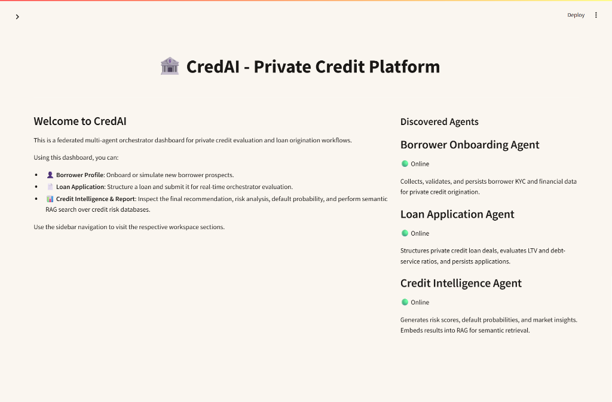
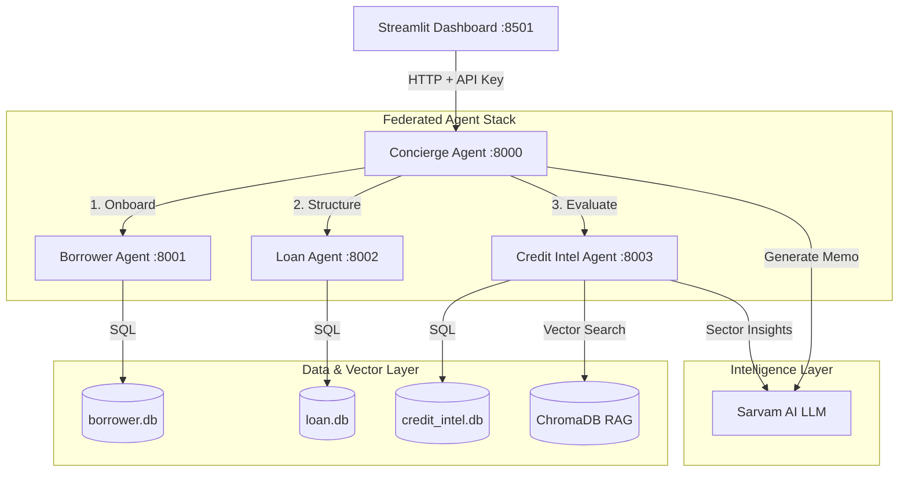

# 🏦 CredAI: Federated Multi-Agent Private Credit System

[](https://www.python.org/)
[](https://fastapi.tiangolo.com/)
[](https://streamlit.io/)
[](https://github.com/astral-sh/ruff)
[](LICENSE)

CredAI is a decentralized, multi-agent credit evaluation and loan origination platform designed specifically for private credit markets. By leveraging **FastAPI** microservices, **LangGraph** workflow orchestration, and **Sarvam AI** reasoning models, the system federates borrower onboarding, loan term structuring, risk ratio validation, and semantic search retrieval-augmented generation (RAG) into a secure, modular, and accessible platform.

---

## 📸 Dashboard Preview

<p align="center">
  
</p>

<p align="center"><em>CredAI — Streamlit-powered multi-agent private credit dashboard with RAG query panel</em></p>

---

## 🏗️ Architecture & Orchestration

The platform is structured as a collection of four decoupled, autonomous microservice peer agents and a responsive light-beige Streamlit frontend dashboard.



### Core Components:

1. **Streamlit Dashboard (Port 8501)**: A premium, mobile-friendly dashboard. Enforces high-contrast color ratios, dynamic forms, loan structuring calculators, and interactive RAG query panels.
2. **Concierge Agent (Orchestrator - Port 8000)**: Coordinates the federated loan workflow using **LangGraph**. Gathers details, triggers the processing pipeline across peer agents, and queries the LLM for a final credit committee report.
3. **Borrower Agent (Port 8001)**: Manages borrower profile persistence. Enforces private credit minimum income thresholds ($50,000) and includes idempotent onboarding logic to handle duplicate profile pings.
4. **Loan Agent (Port 8002)**: Structures loan terms and calculates credit metrics like Debt-Service Ratio (DSR) and Loan-to-Value (LTV). Enforces strict safety envelopes.
5. **Credit Intelligence Agent (Port 8003)**: Computes risk scoring (0-100) and default probabilities. Uses Sarvam AI's reasoning model to generate localized sector insights, maintains SQL audit event logs, and indexes summaries into a persistent **ChromaDB** store using offline embeddings (`all-MiniLM-L6-v2`) for semantic querying.

## ✨ Key Features & Business Rules

### ⚙️ Strict Private Credit Validation Envelopes
To protect lenders and ensure sustainable repayment, the system automatically checks and enforces three key safety rules:
* **Minimum Income Threshold:** Borrowers must have an annual income of **$50,000** or more to onboard.
* **Minimum Loan Size:** The system only processes loans of **$100,000** or more (typical in private credit markets).
* **Maximum Debt-Service Ratio (DSR):** Monthly payments must not exceed **45%** of the borrower's monthly income (`monthly_payment * 12 / annual_income <= 0.45`).
* **Maximum Loan-to-Value (LTV):** The loan amount must not exceed **75%** of the collateral value (`loan_amount / collateral_value <= 0.75`).

### ⚡ Database Quick-Load Integration (Refresh Resilience)
If you refresh the browser page or clear the session state, you **never** have to restart from scratch:
* **Onboarding Page:** Contains a drop-down list of all previously onboarded borrowers. Click any name to instantly load their profile!
* **Loan Structuring Page:** If your session is empty, selecting any existing borrower from the database dropdown will immediately unlock the structuring page.

### 📝 Plain-English Credit Committee Memos
To ensure credit decisions are transparent to borrowers and branch staff alike, the AI avoids heavy banking jargon and explicitly explains financial acronyms (like DSR and LTV) in supportive, friendly, and practical plain English.


## 🚀 Getting Started

### 📋 Prerequisites
* **Python 3.11** or **Python 3.12** installed on your system.
* A standard terminal shell (PowerShell or Cmd on Windows, Terminal on macOS/Linux).
* An active internet connection (to download sentence embeddings during initial setup and connect to the LLM).

### 🛠️ 1. Clone & Set Up Virtual Environment

Open your terminal and run the following commands:

```bash
# Clone the repository
git clone https://github.com/your-username/Multi_Agent_Private_Credit_card_System.git
cd Multi_Agent_Private_Credit_card_System

# Create a fresh, Windows-compatible virtual environment
python -m venv .venv

# Activate the virtual environment
# On Windows PowerShell:
.venv\Scripts\Activate.ps1
# On Windows Command Prompt:
.venv\Scripts\activate.bat
# On Git Bash / macOS / Linux:
source .venv/Scripts/activate

# Install all package dependencies
pip install -r requirements.txt
```

### 🔑 2. Configure Environment Variables
Create a file named `.env` in the root directory and populate it with your API keys and service configurations:

```env
# Sarvam AI LLM API Key (OpenAI-compatible client)
SARVAM_API_KEY=your-sarvam-api-key-here
LLM_MODEL=sarvam-m
LLM_BASE_URL=https://api.sarvam.ai/v1

# Security API key for inter-agent validation
INTERNAL_API_KEY=secret-internal-key

# Service URLs
BORROWER_AGENT_URL=http://localhost:8001
LOAN_AGENT_URL=http://localhost:8002
CREDIT_AGENT_URL=http://localhost:8003

# Embedding Configuration
EMBED_MODEL=text-embedding-3-small
CHROMA_PATH=./chroma_db
LOG_LEVEL=INFO
```

## 🏃 Usage & Run Guide

To run the entire federated agent stack locally, open **five separate terminal windows** (ensure the `.venv` virtual environment is activated in each) and launch the components in the following order:

### 1. Start the Backend Agent Stack

* **Concierge Orchestrator (Port 8000)**:
  ```powershell
  uvicorn src.agents.concierge_agent.main:app --port 8000 --reload
  ```
* **Borrower Onboarding Agent (Port 8001)**:
  ```powershell
  uvicorn src.agents.borrower_agent.main:app --port 8001 --reload
  ```
* **Loan Structuring Agent (Port 8002)**:
  ```powershell
  uvicorn src.agents.loan_agent.main:app --port 8002 --reload
  ```
* **Credit Intelligence Agent (Port 8003)**:
  ```powershell
  uvicorn src.agents.credit_intelligence_agent.main:app --port 8003 --reload
  ```

### 2. Launch the Streamlit Frontend

* **Streamlit Dashboard (Port 8501)**:
  ```powershell
  streamlit run src/frontend/app.py
  ```
The dashboard will open automatically in your browser at `http://localhost:8501`.

## 📖 Step-by-Step Walkthrough Example

Follow this quick guide to run a complete evaluation cycle:

### 👤 Step 1: Onboard a Borrower
1. Go to the **Borrower Onboarding** page in the dashboard.
2. Enter the following parameters:
   * **Full Name:** `Chirag`
   * **Email:** `chiragjain03@gmail.com`
   * **Annual Income ($):** `75000` *(Must be at least $50,000)*
   * **Credit Score:** `698`
   * **Employment Status:** `employed`
   * **Company Name:** `Arihant Industries`
3. Click **Submit & Save Onboarding**. Under the hood, the **Borrower Agent** validates the income and saves the profile to `borrower.db`, generating a unique **Borrower ID** (e.g. `BRW-2666ACF7`).

### 📄 Step 2: Structure the Loan
1. Navigate to the **Loan Application** page.
2. Paste the **Borrower ID** generated in Step 1.
3. Enter the loan parameters:
   * **Loan Amount ($):** `100000` *(Must be at least $100,000)*
   * **Loan Term (Months):** `60` *(Recommended to keep DSR under 45%)*
   * **Collateral Type:** `Real Estate`
   * **Collateral Value ($):** `300000` *(LTV = 33.3%, well below the 75% limit)*
   * **Purpose:** `Working Capital`
4. Click **Submit Application for Orchestrator Evaluation**. The **Loan Agent** will calculate the ratios, verify safety limits, and return a **Loan ID** (e.g. `LN-CF16548A`).

### 📊 Step 3: View the Plain-English Memo
1. Click the **View Credit Memo / Report** button to go to the report page.
2. The page displays a premium styled report showing:
   * **Credit Memo Overview:** An encouraging 3-paragraph plain-English summary detailing the deal terms, explaining LTV/DSR ratios using friendly analogies, and giving a clear final recommendation.
   * **Risk & Market Analysis:** Banners displaying identified risk factors (e.g. manufacturing sector cost headwinds) and RAG-retrieved market insights.
   * **Interactive RAG Query Panel:** Allows bank staff to search the database semantically. Try querying: `"Manufacturing sector risk profiles with good collateral"`.

## ⚡ API / Endpoints List

### 🏨 1. Concierge Agent (Orchestrator - Port 8000)
* `POST /process` - Main endpoint. Orchestrates the full LangGraph workflow.
* `GET /agents` - A2A discovery endpoint. Lists all active peer agent cards.
* `GET /query?q=<query>` - Proxies semantic RAG queries to the Credit Intelligence Agent.

### 👤 2. Borrower Onboarding Agent (Port 8001)
* `POST /borrowers` - Onboards and saves a new borrower.
* `GET /borrowers/{id}` - Retrieves a borrower's profile.

### 📄 3. Loan Structuring Agent (Port 8002)
* `POST /loans` - Validates and structures a loan term sheet.
* `GET /loans/{id}` - Retrieves structured loan metrics.

### 🧠 4. Credit Intelligence Agent (Port 8003)
* `POST /intelligence` - Computes risk scores and default probabilities, generates sector insights, and indexes records in ChromaDB.
* `GET /intelligence/query?q=<query>` - Queries the ChromaDB vector store.


## 🧪 Development, Testing & Code Style

### 📏 Code Style Guidelines
This project enforces clean code practices using **Ruff**.
* **Configuration:** Standard rules defined in `pyproject.toml`.
* **Line Length Limit:** 100 characters.
* **Imports:** Ordered alphabetically and grouped cleanly.
* **Docstrings:** Required for all public API routes and handlers.

To check and auto-format your code style:
```bash
# Lint the code using Ruff
ruff check src/

# Auto-fix code style issues
ruff check src/ --fix
```

### 🧪 Running Tests
Automated test suites are managed via `pytest`.
```bash
# Run all unit tests
.venv\Scripts\pytest

# Run tests with output printing enabled
.venv\Scripts\pytest -s
```

*Note: If live integration tests are written in the future, they can be selected using the `@pytest.mark.integration` marker.*


## 🛠️ Troubleshooting & FAQ

#### Q: I get `Script Execution Policy` error when running `.venv\Scripts\Activate.ps1` in PowerShell?
**A:** Windows restricts scripts by default. You can bypass this restriction for your current PowerShell window by running:
```powershell
Set-ExecutionPolicy -ExecutionPolicy RemoteSigned -Scope Process
```
Then rerun the activation command.

#### Q: Uvicorn throws `ModuleNotFoundError: No module named 'openai'` or `'streamlit'`?
**A:** This happens if you accidentally start the server using your global python installation instead of your virtual environment. Always make sure `(.venv)` is visible at the beginning of your terminal prompt before running servers!

#### Q: I see `Port already in use` error when starting a service?
**A:** A previously crashed or lingering server might still be listening. You can run the following PowerShell command in Windows to forcefully shut down all five development ports:
```powershell
@(8000, 8001, 8002, 8003, 8501) | ForEach-Object {
    $port = $_
    $pidToKill = (Get-NetTCPConnection -LocalPort $port -ErrorAction SilentlyContinue).OwningProcess | Unique
    if ($pidToKill) {
        $pidToKill | ForEach-Object { Stop-Process -Id $_ -Force -ErrorAction SilentlyContinue; Write-Output "Stopped process $_ listening on port $port" }
    }
}
```

## 📈 Roadmap & Phased Enhancement Plan

* [x] **Phase 1: Local Development & Windows Compatibility** (Complete)
  * Clean up legacy macOS system folders (`__MACOSX`).
  * Rebuild Windows-native virtual environments.
  * Resolve dependency version mismatches.
* [x] **Phase 2: Plain-English Reasoning & Quick-Load UI Integrations** (Complete)
  * Enforce plain-English LLM prompt limits.
  * Embed LTV/DSR user-friendly descriptions.
  * Implement browser refresh resilience via SQLite DB quick-load fields.
* [ ] **Phase 3: Production Deployment & Docker Containerization** (In Progress)
  * Stabilize `docker-compose.yml` configs.
  * Switch databases from development SQLite to production-ready PostgreSQL (`psycopg2-binary`).
  * Implement persistent volume mapping for ChromaDB indexing.


### Contributing Guidelines
1. Fork the project repository and create your feature branch (`git checkout -b feature/AmazingFeature`).
2. Verify that your edits comply with Ruff styling: `ruff check src/`.
3. Commit your changes using a clear descriptive message (`git commit -m 'Add some AmazingFeature'`).
4. Push to the branch (`git push origin feature/AmazingFeature`) and submit a Pull Request.

### Code of Conduct
Please be polite, collaborative, and inclusive. Refer to standard professional developer codes of conduct.

## 👥 Authors & Contact
* **Soujanya S P** - Lead System Architect & Orchestration Engineer (`spsoujanya02@gmail.com`)
* **Project Link:** [https://github.com/Soujuhegde/CredAI---Private-Credit-Platform-](https://github.com/Soujuhegde/CredAI---Private-Credit-Platform-)
