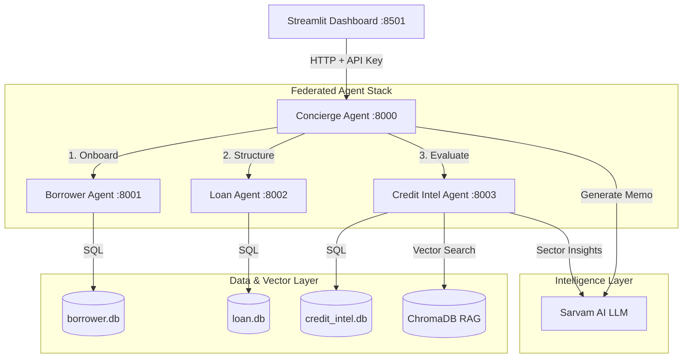

# 🏦 CredAI: Federated Multi-Agent Private Credit System

CredAI is a decentralized, multi-agent credit evaluation and loan origination platform designed for private credit markets. The system leverages **FastAPI** microservices, **LangGraph** workflow orchestration, and **Sarvam AI** reasoning models to onboard borrowers, structure deals, evaluate risk ratios, generate credit memos, and index credit summaries for retrieval-augmented semantic search.

---

## 🏗️ Architecture & Orchestration

The platform is structured as a collection of four decoupled, autonomous peer agents and a responsive light-beige Streamlit frontend dashboard.



### Core Components:

1.  **Streamlit Dashboard (Port 8501)**: A premium, mobile-friendly light-beige dashboard. Enforces WCAG 2.1 AA color contrast compliance, featuring dynamic borrower forms, loan structuring calculators, and interactive RAG query panels.
2.  **Concierge Agent (Orchestrator - Port 8000)**: Coordinates the federated loan workflow using **LangGraph**. Gathers details, triggers the processing pipeline across peer agents, and queries the LLM for a final credit committee report.
3.  **Borrower Agent (Port 8001)**: Manages borrower profile persistence. Enforces private credit minimum income thresholds ($50,000) and includes idempotent onboarding logic to handle duplicate profile pings.
4.  **Loan Agent (Port 8002)**: Structures loan terms and calculates credit metrics like Debt-Service Ratio (DSR) and Loan-to-Value (LTV). Enforces strict safety envelopes (DSR $\le$ 45%, LTV $\le$ 75%, Minimum Loan $\ge$ $100,000).
5.  **Credit Intelligence Agent (Port 8003)**: Computes risk scoring (0-100) and default probabilities. Uses Sarvam AI's reasoning model to generate localized sector insights, maintains SQL audit event logs, and indexes summaries into a persistent **ChromaDB** store using offline embeddings (`all-MiniLM-L6-v2`) for semantic querying.

---

## ⚙️ Configuration & Environment Variables

Create a `.env` file in the root directory to configure the agent URLs, API keys, and model parameters:

```env
# Sarvam AI LLM API Key (OpenAI-compatible client)
SARVAM_API_KEY=your-sarvam-api-key-here
LLM_MODEL=sarvam-m
LLM_BASE_URL=https://api.sarvam.ai/v1

# Security API key for inter-agent validation
INTERNAL_API_KEY=secret-internal-key

# Service URLs
BORROWER_AGENT_URL=http://localhost:8001
LOAN_AGENT_URL=http://localhost:8002
CREDIT_AGENT_URL=http://localhost:8003

# Embedding Configuration
EMBED_MODEL=text-embedding-3-small
CHROMA_PATH=./chroma_db
LOG_LEVEL=INFO
```

---

## 🚀 Installation & Local Setup

### 1. Clone & Set Up Virtual Environment
```bash
# Clone the repository
git clone https://github.com/your-username/Multi_Agent_Private_Credit_card_System.git
cd Multi_Agent_Private_Credit_card_System

# Create and activate python virtual environment
python -m venv .venv
source .venv/bin/activate  # On Windows use: .venv\Scripts\activate

# Install dependencies
pip install -r requirements.txt
```

### 2. Run the Backend Agents (Separate Terminals)
Run each microservice in its own terminal window or in the background:

*   **Concierge Orchestrator (Port 8000)**:
    ```bash
    .venv/bin/uvicorn src.agents.concierge_agent.main:app --port 8000 --reload
    ```
*   **Borrower Onboarding Agent (Port 8001)**:
    ```bash
    .venv/bin/uvicorn src.agents.borrower_agent.main:app --port 8001 --reload
    ```
*   **Loan Structuring Agent (Port 8002)**:
    ```bash
    .venv/bin/uvicorn src.agents.loan_agent.main:app --port 8002 --reload
    ```
*   **Credit Intelligence Agent (Port 8003)**:
    ```bash
    .venv/bin/uvicorn src.agents.credit_intelligence_agent.main:app --port 8003 --reload
    ```

### 3. Run the Streamlit Dashboard
Launch the dashboard to interact with the platform:
```bash
.venv/bin/streamlit run src/frontend/app.py
```

---

## 🧪 Testing

Automated tests can be executed via `pytest`:
```bash
.venv/bin/pytest
```

---

## 🛡️ Security & Inter-Agent Authentication

All federated API endpoints are secured by an `x-api-key` header. If a peer agent makes a call without a matching `INTERNAL_API_KEY` token, a `401 Unauthorized` exception is raised.

Furthermore, database changes in the credit intelligence agent are tracked in an append-only audit trail (`credit_intelligence_events`), logging every creation, retry, and exception event with deterministic IDs.
